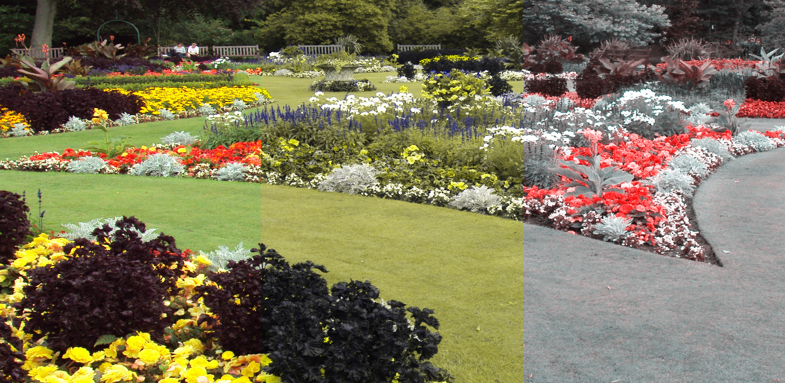

# ColourBlind

Android app for simulating colour blindness arising from the lack of red, green or blue light receptors.

Get it at [Google Play](), or download the [latest release](https://github.com/inclement/colour-blind-camera/releases) directly.

  

The colour transformations are applied directly to the camera stream. Switch between different colour blindness modes to see which colours can no longer be distinguished.

Supported colour blindness modes are:
* Protanopia: complete lack of red light receptors
* Deuteranopia: complete lack of green light receptors
* Tritanopia: complete lack of blue light receptors

The colour transformations use the method of Viénot, Brettel and Mollon, "[Digital Video Colourmaps for Checking the Legibility of Displays by Dichromats](https://onlinelibrary.wiley.com/doi/abs/10.1002/%28SICI%291520-6378%28199908%2924%3A4%3C243%3A%3AAID-COL5%3E3.0.CO%3B2-3)", Color Research and Application 24, 1999.

Screenshot examples on Google Play and banner above use [this image](https://en.wikipedia.org/wiki/File:Flower_garden,_Botanic_Gardens,_Churchtown_2.JPG), licensed under Creative Commons Attribution-Share Alike 3.0 Unported: https://creativecommons.org/licenses/by-sa/3.0/deed.en

## Technical details

ColourBlind is written in Python using [Kivy](https://kivy.org/#home). It was created as a technical investigation of accessing the Android [camera2 API](https://developer.android.com/reference/android/hardware/camera2/package-summary) from Python.
